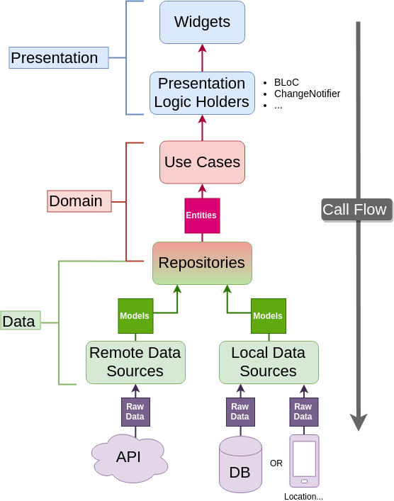

# voluntiersapp

O projeto é uma solução que visa criar uma ferramenta para gerenciar a escala de trabalho voluntário em uma instituição. A enfase, a principio, será para umaa primeira unidade da **Younity Church**, sediada em Florianópolis, Brasil.

## Architecture

A estrutura apresentada na imagem é uma representação de arquitetura de software, que parece ser uma variação da arquitetura *Clean* ou *Hexagonal*, onde a separação de responsabilidades é clara entre a interface do usuário (***UI***), a lógica de negócios (***domínio***) e as fontes de dados (***dados***).

Para implementar uma estrutura em Flutter seguindo o diagrama e utilizando Cubit para gerenciamento de estado e GetIt para injeção de dependência, você pode estruturar seu projeto da seguinte maneira:

## Presentation

Esta camada contém tudo relacionado à UI (Widgets) e aos detentores da lógica de apresentação (Presentation Logic Holders), que poderiam ser Cubits em nosso caso.

## Domain

Aqui, você define seus *Use Cases* e *Entities*. Use Cases são operações ou funções que representam todas as possíveis ações do usuário.
Na Clean Architecture, o domínio é geralmente o núcleo central e deve ser independente de frameworks e detalhes externos, como banco de dados e a interface do usuário. Ele contém a lógica de negócios fundamental que não muda quando algo externo muda.

##### Aqui estão algumas razões pelas quais você pode ver variações na estrutura

1. ***Abstrações de Repositórios no Domínio:*** Algumas equipes optam por colocar as abstrações dos repositórios (interfaces) dentro do domínio para enfatizar que o domínio define como os dados devem ser acessados, mas não se preocupa com os detalhes de implementação. Isso segue o princípio da inversão de dependência, onde os detalhes dependem das abstrações, não o contrário.

2. ***Implementações de Repositórios em Data:*** As implementações concretas desses repositórios normalmente residem na camada de dados. Isso ocorre porque as implementações específicas (como o acesso a um banco de dados SQLite ou uma API remota) são detalhes que o domínio não deve conhecer.

## Data

Esta camada contém os Repositories que servem como ponte entre a lógica de negócios e a fonte de dados, e os Models que são as representações de dados usadas tanto no domínio quanto nas fontes de dados.

Data Sources: Divididos em Remote Data Sources (por exemplo, APIs) e Local Data Sources (por exemplo, banco de dados local).

##### Detalhes quanto ao modelo de dados dentro de domínio ou dentro de data

* ***Models no Domínio:*** Se os modelos são usados como entidades de domínio e fazem parte da lógica de negócios, faz sentido colocá-los no domínio. Eles seriam então "entidades" no sentido da Clean Architecture.

* ***Models em Dados:*** Se os modelos são simplesmente objetos de transferência de dados (DTOs) que mapeiam os dados da camada de dados para o domínio, então eles geralmente pertencem à camada de dados. Eles servem como um meio para transferir dados entre camadas e podem estar sujeitos a alterações se o esquema de dados mudar.

##### Converter Model para Entity

Converter Model para Entity é uma prática útil por várias razões dentro da Clean Architecture e outros padrões de design de software:

1. ***Separação de Preocupações:*** Mantém a lógica de negócios separada da lógica de persistência de dados. As entidades são usadas na camada de domínio e nos casos de uso, enquanto os modelos são usados para comunicação com a camada de dados (como APIs e bancos de dados).

2. ***Proteção da Lógica de Negócios:*** Ao converter um Model (que pode ser uma representação direta dos dados de um banco de dados ou API) para um Entity, você está garantindo que apenas dados validados e aprovados estão sendo usados nos casos de uso e na lógica de negócios. Isso ajuda a prevenir estados inválidos dentro da lógica de domínio.

3. ***Flexibilidade:*** Permite que o Model e o Entity evoluam independentemente um do outro. Por exemplo, se você decidir alterar a estrutura do banco de dados ou a resposta da API, você só precisaria ajustar o UserModel e o método de conversão, ao invés de refatorar a lógica de negócios em todo o seu aplicativo.

4. ***Mapeamento de Dados:*** Facilita o mapeamento entre a representação dos dados que vem de fontes externas e a representação que você quer usar dentro da sua lógica de negócios. Por exemplo, o UserModel pode conter todos os campos retornados por uma API, enquanto o Entity pode conter apenas os campos necessários para a lógica de negócios.

5. ***Testabilidade:*** Torna mais fácil testar a lógica de negócios de forma isolada, uma vez que os testes podem ser realizados em Entity sem depender dos detalhes da implementação do UserModel ou da camada de dados.

6. ***Manutenibilidade:*** Facilita a manutenção do código, já que as alterações na estrutura de dados externos não afetam diretamente a lógica de negócios. Você só precisaria ajustar a conversão em um local.

7. ***Intercambiabilidade de Fontes de Dados:*** Permite que você mude as fontes de dados sem alterar a lógica de negócios, pois você pode ter diferentes implementações de UserModel para diferentes fontes de dados, mas um Entity unificado para a lógica de negócios.

Ao adicionar um método de conversão, você está essencialmente criando um ponto de transição entre a camada de dados e a camada de domínio, permitindo que o seu sistema seja mais modular e resiliente a mudanças.
